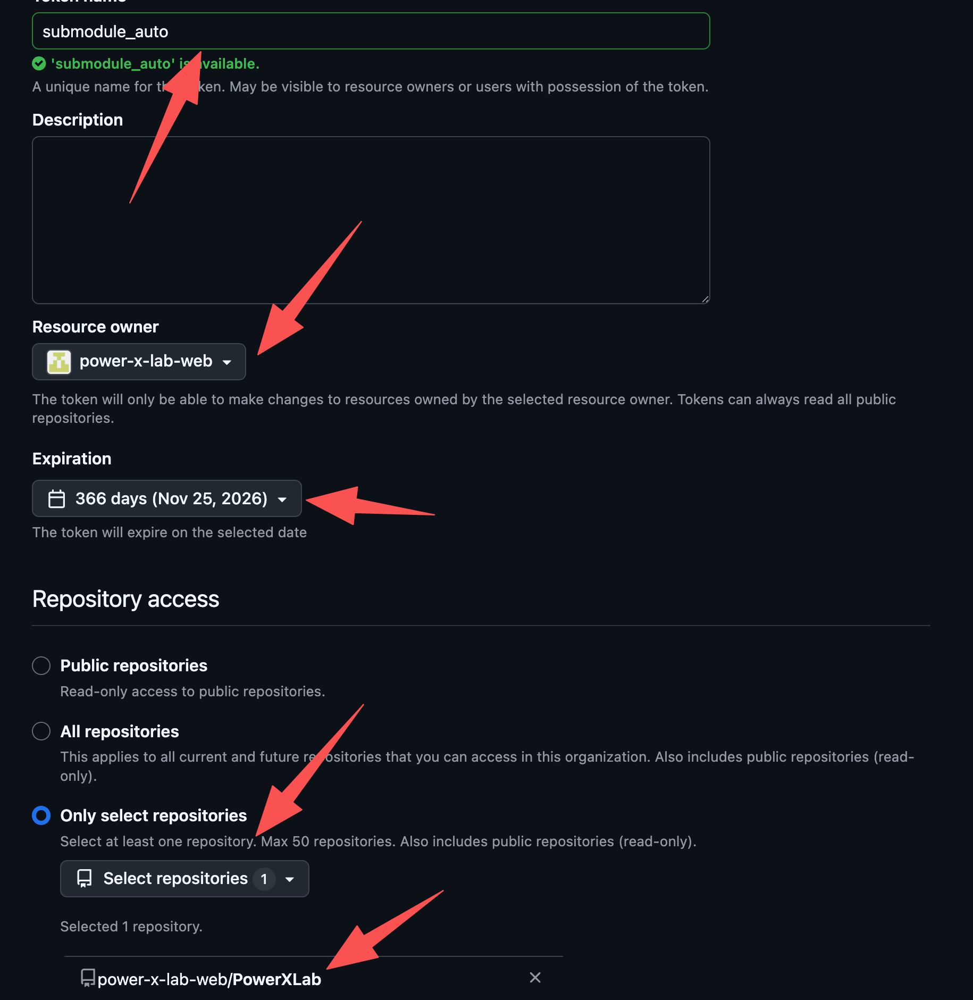
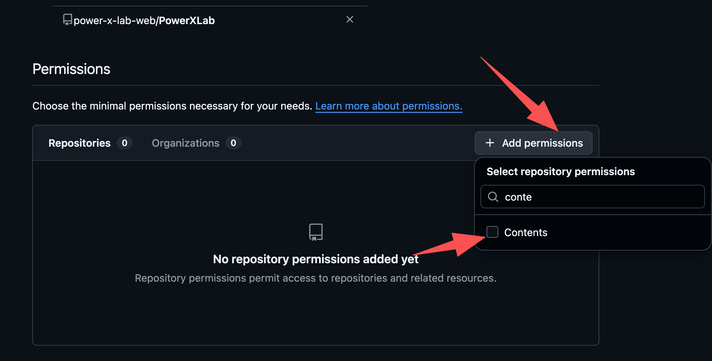
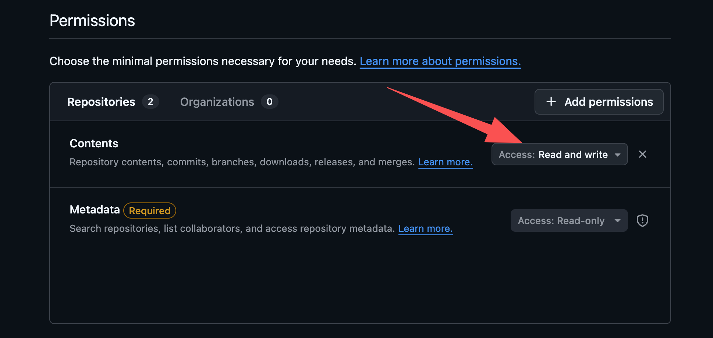
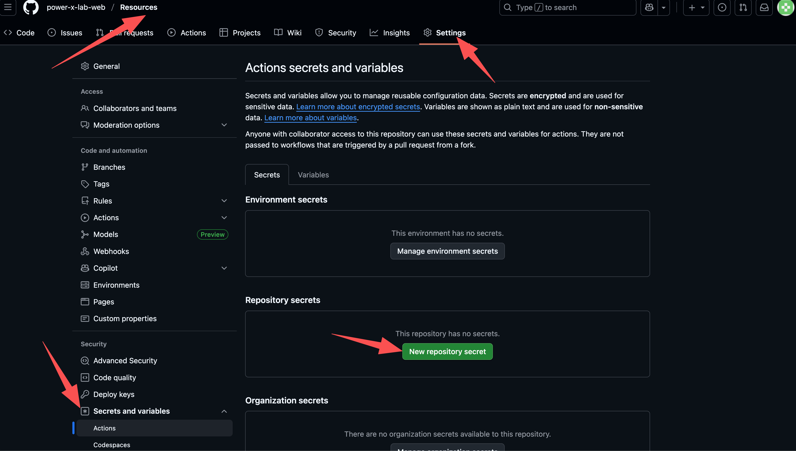

# Guidance for maintainer

## Set auto-update for Submodule

1. What can auto-update function do?
   The auto-update function is used for auto-committing the submodule to the top repo. The file structure in out lab looks like:

   ```
   - PowerXLab (top repo)
        - HTML
        - CSS
        - JS
        - index.html
        - Resources (submodule)
            - icons
            - images
            - ...
        - Guidance (submodule)
            - Examples
            - xxx.md
    ```

    It means when someone adds or deletes something in the submodule repo, the top repo will be auto updated.

2. Generate a ***Fine-grained tokens***
   
   2.1. Click your profiles -> Settings -> Developer settings -> Personal access tokens -> Fine-grained tokens. You need to choose the organization ***power-x-lab-web***, and select the top repo ***PowerXLab***.

   

Add ***contents read and write*** permissions.





3. Go to the submodule ->  settings -> Secrets and Variables -> Actions -> New Repository Secrets.



Name the secret as ***SUPER_REPO_TOKEN***, and paste the PAT key.


4. Create a new file in the root folder of the submodule `.github/workflows/bump-super.yml`

```
name: Bump super repo submodule

on:
  push:
    branches: [ master ]  # 或者你自己的默认分支

jobs:
  bump-super:
    runs-on: ubuntu-latest

    steps:
      # 1. 检出顶层 repo
      - name: Checkout super repo
        uses: actions/checkout@v4
        with:
          repository: power-x-lab-web/PowerXLab   # ✅ 顶层仓库全名
          token: ${{ secrets.SUPER_REPO_TOKEN }}
          submodules: true                       # 把 submodule 一起拉下来

      # 2. 更新 submodule 指到最新提交
      - name: Update submodule to latest
        run: |
          cd Resources         # ✅ 顶层 repo 中 submodule 的路径
          git fetch origin master         # ✅ submodule 默认分支
          git checkout origin/master
          cd -

          git config user.name "github-actions[bot]"
          git config user.email "github-actions[bot]@users.noreply.github.com"

          git add Resources
          git commit -m "chore: bump submodule to latest" || echo "No changes to commit"
          git push origin master          # ✅ 顶层 repo 默认分支
```

## Automatically generate a sitemap.xml file to improve search engine indexing.

1. Create `.github/workflows/sitemap.yml`
2. Paste the following codes
```
name: Generate sitemap

on:
  push:
    branches: [ master ]

permissions:
  contents: write   # 允许这个 workflow 往仓库里提交

jobs:
  sitemap_job:
    runs-on: ubuntu-latest

    steps:
      - name: Checkout repo
        uses: actions/checkout@v4
        with:
          fetch-depth: 0   # 这个 action 需要完整 commit 历史来算 <lastmod>

      - name: Generate sitemap.xml
        uses: cicirello/generate-sitemap@v1
        with:
          base-url-path: https://powerxlab.pages.dev/
          # 如果你的站点根目录不是仓库根（比如在 /public），这里加：
          # path-to-root: public

      - name: Commit sitemap.xml
        run: |
          git config user.name "github-actions[bot]"
          git config user.email "41898282+github-actions[bot]@users.noreply.github.com"
          git add sitemap.xml
          git commit -m "Update sitemap" || echo "No changes to commit"
          git push
```
3. Commit the code to github. 