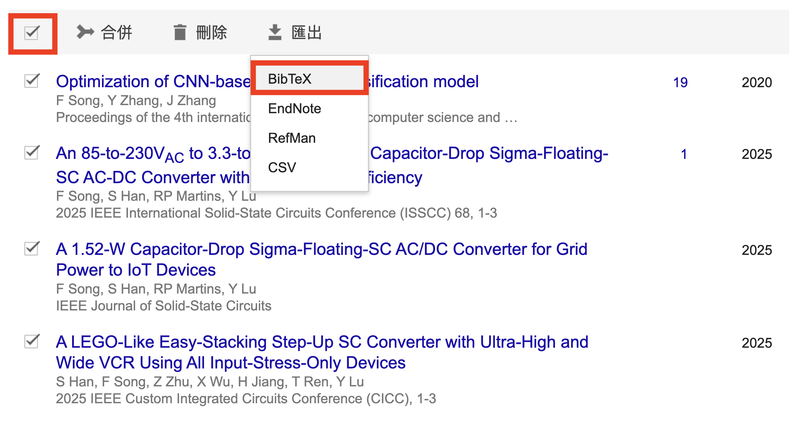
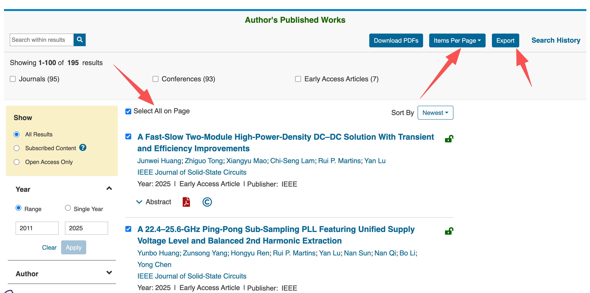
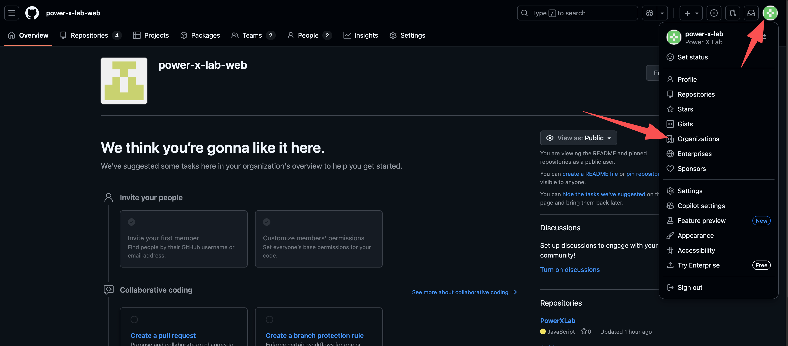
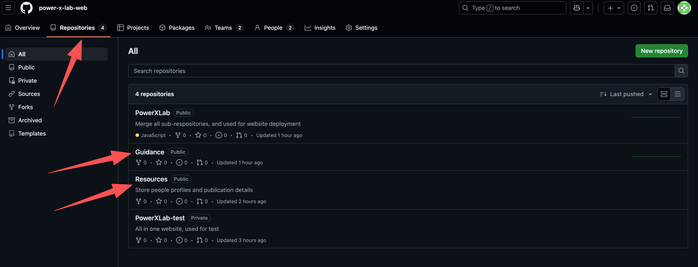
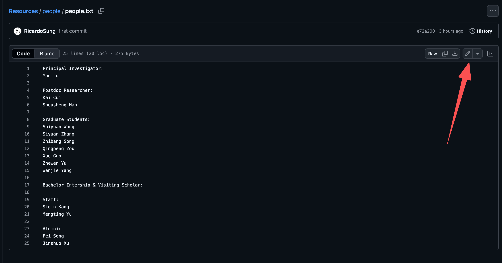
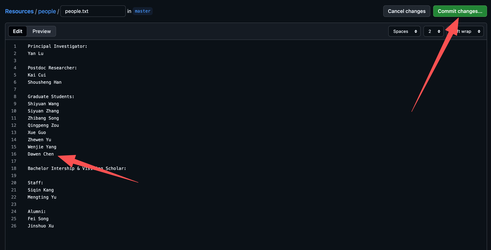
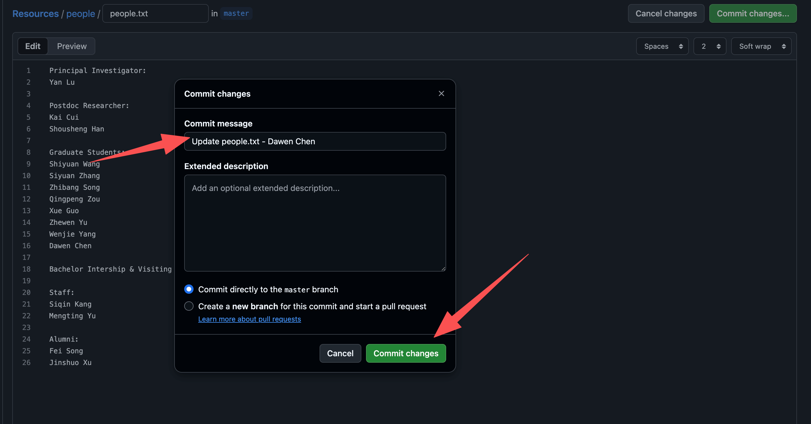
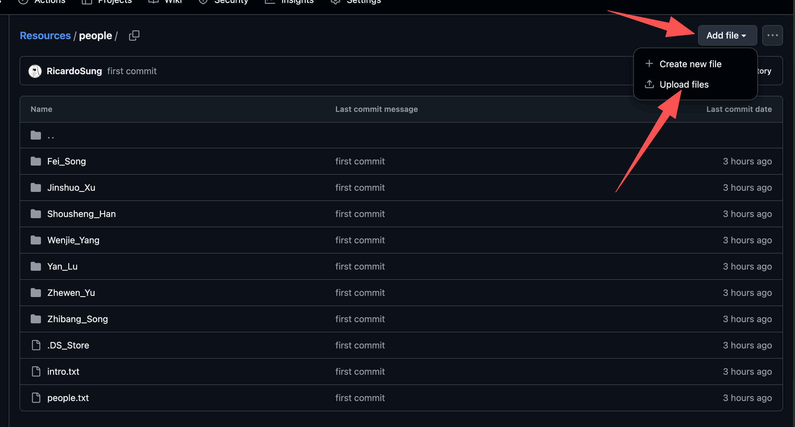
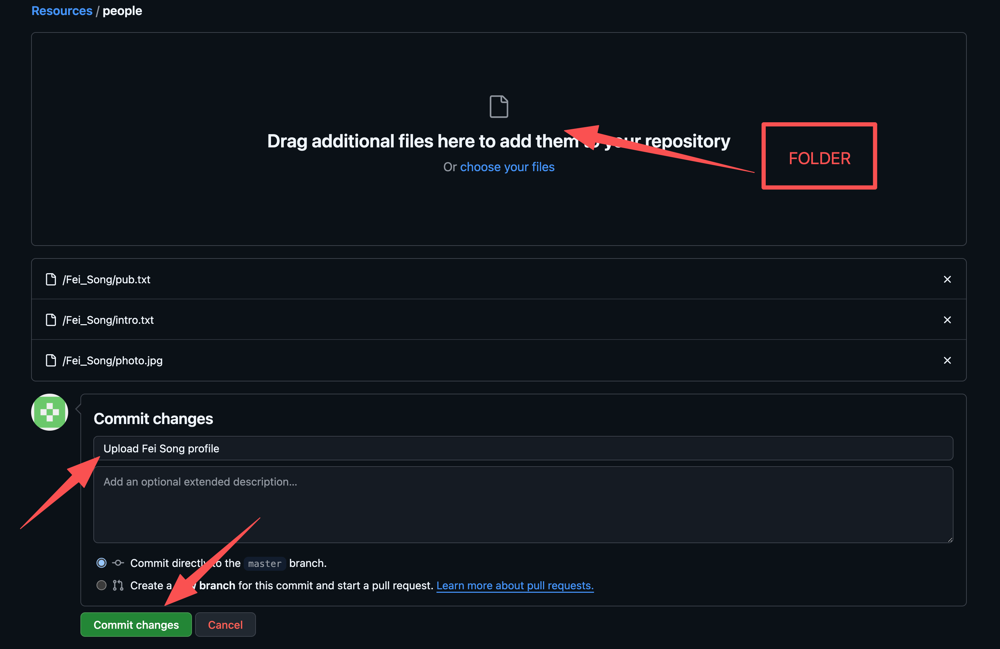

# How to update your profile

## Prepare all your materials

1. Enter your information in `/Guidance/Examples/intro.txt`
   - If you don't want to share some information, please delete the specific line.
   - Please select your position among the provided choices.
   - You can write multiple paragraphs in introduction but forbidden in other sections.
   - Keep a new line between different sections.
2. Your portrait should be ***4:3*** ratio (height:width) and `.jpg` file type.
3. Download your publication citation information to `/Guidance/Examples/pub.txt`.
   ***It should be BibTeX format.***

   ***Only recognize three types: article, inproceedings, and books.***

   ***If the citation file includes DOI, the link pointing to the publication website will be generated automatically.***

   There are three methods to download the file:
    3.1. From your [Google Scholar](https://scholar.google.com/).
    -  Go to the profile.
    - Click the`checkbox`.
    - Export the citation as ***BibTeX*** format.

    3.2. From your IEEE author page, where you can find all your publications
    -  Click ***Items Per Page*** to list more publications in one page
    - Click the `checkbox` to select all the publications
    - Export Citations in ***BibTeX*** format with citations only.

    3.3. Manually fill the `pub.txt`.

## Update your profile by yourself

1. Create a Github account.
2. Ask the PI or the person who is in charge of maintaining the lab website to add you to the PowerXLab organization in Github.
3. Go to the ***Github profile***, then ***Organization***, and ***accept the organization invitation***.

4. In the ***Repositories***, you will see all the respos.
***If you are not a maintainer, the "Resources" is the only repo that you can write to. All other repositories are read-only.***

5. Open the ***Resources*** repo, and the ***People** folder.
6. Add your name to `/Resources/People/people.txt`.

7. Tell us what you have changed using the ***commit message***, and then submit ***commit changes***.

8. Back to `/Resources/People` and upload the ***profile folder***, which includes `photo.jpg`, `intro.txt` and `pub.txt`. 
***Remember to rename the folder as `<FirstName>_<Surname>`.***

9. Drag the ***profile folder*** to upload, and leave the commit message.

10.  Back to the lab website, and you will see the updates.

***With the privilege to make changes in the `Resources` repo, you can modify your information even after you graduate.***

***The People tab displays individuals in the order defined in `/Resources/People/people.txt`.***

## Update your profile by the maintainer

***It depends on how much spare time the maintainers have. Whenever possible, you’re encouraged to manage these tasks on your own.***

### Why not mirror the publications from Google Scholar or IEEE

***Because Google Scholar and IEEE impose strict web-crawler restrictions, I can’t achieve this using JavaScript (or other frontend techniques). If you want this feature, the site will need a database and a backend, which will increase the cost.***